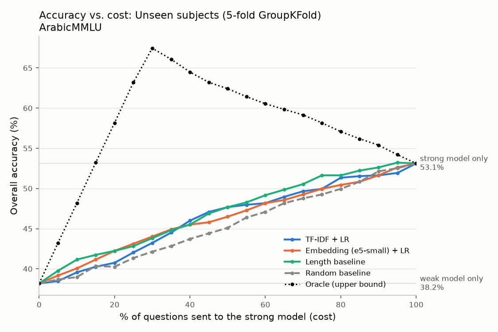

# Arabic LLM Router

A RouteLLM-style router for Arabic: for each multiple-choice question it decides whether a
small, cheap model is enough or whether the question should go to a larger, more expensive
model. Evaluated on ArabicMMLU.

> **Main finding:** the two models disagree a lot. A perfect router could reach 67.6%
> accuracy, compared with 53.1% for the strong model alone. But routers that only read
> the question text barely beat random routing here. The weak model's correctness is
> driven mostly by a bias toward answering "A", which cannot be seen from the question.
> All numbers below come from real model runs on 1,011 questions.

## Problem: cost vs. quality

Large language models answer better but cost more per call (money, latency, hardware).
Many questions are easy enough for a small model. A **router** looks at a question
*before* answering it and predicts whether the large model is actually needed. A good
router gets close to large-model accuracy while sending only part of the traffic to the
large model. RouteLLM ([Ong et al., 2024](https://arxiv.org/abs/2406.18665)) studied this
for English. This project repeats the evaluation for **Arabic**.

## Data and licenses

- **ArabicMMLU** ([MBZUAI/ArabicMMLU](https://huggingface.co/datasets/MBZUAI/ArabicMMLU),
  Koto et al., 2024), licensed **CC BY-NC 4.0** (non-commercial).
  - Modern Standard Arabic school and professional exam questions, `test` split:
    14,455 questions.
  - **Subject** = `Subject` + `Level`, which gives 40 groups (e.g. "History (High)").
  - Questions with a `Context` passage (707) keep the passage above the question.
  - **40 questions removed:** the text of their correct option also appears in another
    option (the diacritics seem to have been lost), so they cannot be answered.
    That leaves **14,415 questions**.
  - **Working sample:** 1,500 questions, stratified by subject in proportion to subject
    size (every subject has at least 3), seed 42, in shuffled order.
    - The weak model answered all 1,500.
    - The strong model (about 25 s per question on CPU) was stopped after
      **1,011**. Because the order was shuffled, those 1,011 are a random subset.
      They cover all 40 subjects, but the smallest subjects have only 1–2 questions.
    - **All results use these 1,011 questions.**
- **Code in this repo:** MIT (see `LICENSE`). The dataset is not redistributed here; it
  is downloaded from Hugging Face. The only exception is
  `results/failure_examples.csv`, which quotes 15 ArabicMMLU questions for the failure
  analysis (CC BY-NC 4.0, © the ArabicMMLU authors).

## Models

| Role | Model | Where it runs |
|---|---|---|
| Weak (cheap) | `Qwen/Qwen2.5-0.5B-Instruct` | local CPU, bfloat16 |
| Strong (expensive) | `Qwen/Qwen2.5-3B-Instruct` | local CPU, bfloat16 |
| Router embeddings | `intfloat/multilingual-e5-small` | local CPU |

Both models get exactly the same prompt: the question, the options labelled A–E, and
"Answer with one letter only.". Decoding is greedy, with at most 8 new tokens. A parser
(`src/parse.py`, unit-tested) extracts the letter. A reply with no single valid letter
counts as wrong.

**Why two local models?** The original plan used Qwen2.5-72B through Hugging Face
Inference Providers as the strong model. The free monthly credits ran out during a
10-question pilot, so to keep the budget at $0 both models now run locally. A 0.5B-vs-3B
gap is much smaller than a small-vs-frontier gap, so this is a harder and less typical
setting for routing (see Limitations).

## Method

1. **Collect answers.** Ask both models every question in the sample and record whether
   each was correct (`data/routing_table.csv`). The runs can resume after a crash.
2. **Label.** `need_strong = weak wrong AND strong right`. These are the only questions
   where paying for the strong model changes the outcome.
3. **Routers.** Each one outputs a score in [0, 1] for "needs the strong model", the same
   role as RouteLLM's `calculate_strong_win_rate`:
   - **Random:** a baseline.
   - **Length:** a baseline; longer prompts get higher scores.
   - **TF-IDF:** character 2–5-grams plus logistic regression (class-balanced).
   - **Embedding:** multilingual-e5-small (`"query: "` prefix, mean pooling) plus
     logistic regression.
   - **Oracle:** sees the true labels; an upper bound only.
4. **Two evaluation setups:**
   - (a) a random 70/30 split, stratified on the label;
   - (b) **unseen subjects:** GroupKFold by subject with 5 folds, so the router is always
     tested on subjects it never saw during training.
5. **Metrics (RouteLLM-style).**
   - Send the top *p*% of questions by score to the strong model, for *p* = 0, 5, …, 100,
     and record overall accuracy at each *p*.
   - **AUC** is the area under accuracy vs. fraction routed.
   - **APGR** = (AUC − weak acc) / (strong acc − weak acc). It is about 0.5 for random
     routing, and 1 or more means strong-model accuracy at little cost.
   - Also reported: the % of strong calls needed to reach 90% and 95% of strong-model
     accuracy.
   - **95% bootstrap CI** for APGR from 1,000 resamples of the test questions.
6. **Failure analysis.**
   - The embedding router's 15 most confident wrong decisions:
     - *missed:* sent to weak, which was wrong, while strong was right;
     - *wasted:* sent to strong, while weak was already right.
   - Per-subject AUROC in the unseen-subject setup.

## Results

### The two models (1,011 questions)

| | Weak: Qwen2.5-0.5B | Strong: Qwen2.5-3B |
|---|---|---|
| Accuracy | **38.2%** | **53.1%** |
| Parse failures | 1.0% (15 of its 1,500) | 0.6% (6 of 1,011) |
| Median time per question (laptop CPU) | 3.1 s | 25.5 s |

- **Random guessing** would score 29.6%. This accounts for questions having 2–5 options.

**How the answers combine:**

| Weak | Strong | Share of questions |
|---|---|---|
| right | right | 23.7% |
| **wrong** | **right** | **29.4%** (this is `need_strong`) |
| right | wrong | 14.4% |
| wrong | wrong | 32.4% |

- **Oracle ceiling: 67.6%.** That is the accuracy if every question went to whichever
  model gets it right, which is far above the strong model alone.
- The two models give the same letter on only 38.6% of questions.

### Routing (APGR: 0.5 = random routing; a higher value is better)

**Random 70/30 split** (707 train / 304 test; test weak acc 38.5%, strong acc 51.3%)

| Router | AUC | APGR [95% CI] | % strong for 90% of strong acc | % strong for 95% |
|---|---|---|---|---|
| Random | 0.451 | 0.516 [0.321, 0.719] | 52.6 | 67.1 |
| Length | 0.461 | 0.590 [0.393, 0.870] | 51.6 | 66.4 |
| TF-IDF + LR | 0.462 | 0.599 [0.423, 0.889] | 40.5 | 53.9 |
| Embedding + LR | 0.459 | 0.576 [0.392, 0.821] | 46.1 | 61.8 |
| *Oracle (upper bound)* | *0.569* | *1.435 [1.145, 2.667]* | *7.9* | *10.5* |

**Unseen subjects** (5-fold GroupKFold by subject; every question scored by a router
that never saw its subject; n = 1,011)

| Router | AUC | APGR [95% CI] | % strong for 90% of strong acc | % strong for 95% |
|---|---|---|---|---|
| Random | 0.454 | 0.485 [0.403, 0.562] | 63.7 | 82.7 |
| Length | 0.471 | 0.595 [0.516, 0.694] | 53.1 | 69.9 |
| TF-IDF + LR | 0.463 | 0.545 [0.467, 0.630] | 50.3 | 77.5 |
| Embedding + LR | 0.463 | 0.547 [0.468, 0.630] | 56.6 | 80.4 |
| *Oracle (upper bound)* | *0.579* | *1.318 [1.182, 1.589]* | *9.7* | *12.4* |



Random split: [results/curve_random_split.png](results/curve_random_split.png).

**What this shows:**

- **No learned router clearly beats random routing.**
  - On the random split, every router's 95% CI overlaps the random baseline's.
  - On unseen subjects, the TF-IDF and embedding routers also overlap random.
  - The simple **length baseline** has the highest APGR there (0.595). Its CI only just
    clears random's (lower bound 0.516 vs. random's upper bound 0.562). With 1,011
    questions, that difference is weak evidence.
- **The AUROC at detecting `need_strong` questions was 0.51–0.53 for every real router**,
  which is close to a coin flip.
- **The opportunity is large but not being captured.** The oracle reaches 90% of
  strong-model accuracy with under 10% of questions sent to strong. The routers need
  40–57%.

### Why the routers fail here

The weak model answers "A" on 49.6% of these questions, while "A" is correct on only
32.6%. That bias decides most of its outcomes:

| True answer | Weak accuracy | Strong accuracy | `need_strong` rate |
|---|---|---|---|
| A | 66.1% | 55.8% | 14.2% |
| B–E | 24.7% | 51.8% | 36.7% |

- When the answer is not "A", the weak model scores **24.7%, below random guessing**.
- So whether a question "needs the strong model" depends mostly on the hidden answer
  key, not on anything a router can see in the question.
- The router's job is to predict whether the weak model is right, and here the weak
  model is close to a guessing machine with a letter preference.

### Failure analysis (embedding router)

Details are in `results/failure_examples.csv` and `results/failure_by_subject.csv`.

- **Operating point:** the top 46.1% of the random-split test set sent to strong.
  - It **missed** 45 of the 89 questions that needed the strong model.
  - **51 of its 140 strong calls were wasted**, because the weak model was already right.
- **Among the 15 most confident mistakes**, questions with a reading passage are
  overrepresented: 25% of the missed and 43% of the wasted, against 6% of all test
  questions. Long Arabic Language passages got high scores even when the weak model
  answered them correctly.
- **Per subject** (unseen-subject setup; 17 subjects have enough data to rank):
  - Lowest AUROC: Social Science (Primary) 0.38 and Arabic Language (Primary) 0.44.
  - Highest: Economics (High) 0.83, but on only 26 questions with 5 positives.
  - These per-subject numbers rest on 20–105 questions each and are noisy.

## Limitations

- **The results depend on this specific model pair.** A 0.5B vs. 3B pair (both Qwen 2.5)
  is a narrow quality gap. Routing between a small model and a frontier model, as in
  RouteLLM, can behave very differently.
- **The data is ArabicMMLU:** Modern Standard Arabic school-exam questions. It contains
  no dialects and is not real user traffic.
- **Possible benchmark contamination:** pretrained models may have seen these questions.
- **Sample size:** 1,011 questions with both models' answers (304 in the random test
  split), because the strong run was stopped early to save time. The confidence
  intervals are wide. Per-subject numbers rest on 20–105 questions and only show large
  differences. 23 of the 40 subjects have too few questions to rank.
- **Letter bias dominates the label:** the weak model's "A" preference makes its
  correctness largely unpredictable from the question text. A stronger weak model, or
  shuffling the option order, could give routers a much more learnable signal.
- **One prompt, greedy decoding:** different prompts or option orders could change both
  models' accuracy and the routing results.

## How to reproduce

Windows (PowerShell). On macOS/Linux, use `source .venv/bin/activate` and run the
`python -m` lines directly.

```powershell
python -m venv .venv
.venv\Scripts\activate
pip install -r requirements.txt
copy .env.example .env          # add a Hugging Face token (only needed for API models)

python -m src.data              # load + clean ArabicMMLU, write the stratified sample
python -m pytest -q             # 48 unit tests

scripts\run_model.bat weak      # weak model on all 1,500 questions (own window, resumable)
scripts\run_model.bat strong    # strong model (needs ~6.5 GB free RAM; ~25 s/question;
                                #   can be stopped any time, as here after 1,011)
scripts\run_analysis.bat        # labels, routers, evaluation, failure analysis -> results\

python -m src.demo "ما عاصمة الإمارات العربية المتحدة؟
A. دبي
B. أبوظبي
C. الشارقة"                       # or: python -m src.demo --file question.txt
```

**Practice mode.** `src/practice.py` builds a routing table with *simulated* strong
answers, so the analysis code can be tested before the strong run. With the environment
variable `PRACTICE=1`, every step reads and writes `data/practice/` instead of
`results/`. Practice numbers are never reported.

## Project layout

```
src/config.py        all settings (models, N, seed, paths)
src/data.py          load, clean and sample ArabicMMLU
src/query_models.py  prompts, local/API models, resumable answering, routing table
src/parse.py         answer-letter parser
src/labels.py        need_strong label, stats, random + unseen-subject splits
src/router.py        random / length / TF-IDF / embedding / oracle routers
src/evaluate.py      accuracy-vs-cost curves, AUC, APGR, bootstrap CIs, plots
src/failures.py      worst routing decisions, per-subject difficulty
src/demo.py          command-line demo
src/practice.py      simulated table for testing the pipeline
scripts/             Windows launchers (run_model.bat, run_analysis.bat)
tests/               unit tests
```

## Built on

- **RouteLLM:** I. Ong, A. Almahairi, V. Wu, W.-L. Chiang, T. Wu, J. E. Gonzalez,
  M. W. Kadous, I. Stoica. *RouteLLM: Learning to Route LLMs with Preference Data.*
  arXiv:2406.18665, 2024. Code: https://github.com/lm-sys/RouteLLM. The evaluation
  idea (accuracy vs. % strong calls, APGR) and the router scoring interface come
  from this work.
- **ArabicMMLU:** F. Koto et al. *ArabicMMLU: Assessing Massive Multitask Language
  Understanding in Arabic.* Findings of ACL, 2024. MBZUAI.
- Models: Qwen2.5 (Alibaba Cloud), multilingual-E5 (Microsoft).

## What I added

- A RouteLLM-style evaluation for **Arabic**, on ArabicMMLU, with a small open model pair
  that runs on a laptop CPU at $0.
- An **unseen-subject** evaluation (GroupKFold by subject) that tests whether routers
  transfer to topics they were not trained on.
- **Bootstrap confidence intervals** for APGR, and "% strong calls to reach 90% / 95% of
  strong accuracy".
- A data-quality fix: removing 40 ArabicMMLU questions whose correct option is
  duplicated.
- An answer parser that handles both Latin and Arabic option letters.
- Resumable model runs.
- Failure analysis of the router's most confident mistakes and of the subjects that are
  hardest to route.
- A command-line demo that loads only the model the router picks.
